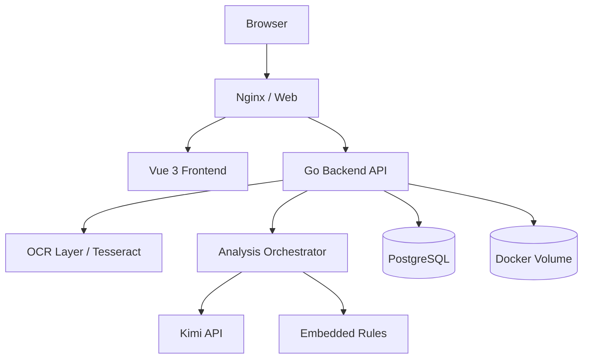
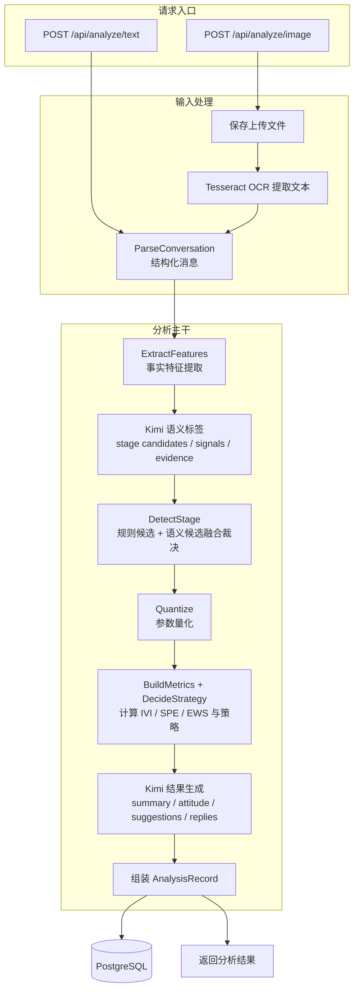

# Senti

Senti 是一个网页端聊天分析 MVP，支持上传聊天长截图或粘贴聊天文本，结合内置分析规则、后端 OCR 能力和 `Kimi API` 生成互动阶段、态度倾向、聊天建议与回复参考。

## 许可证与使用限制

本仓库根目录采用自定义限制性许可证，默认 `All Rights Reserved`。

- 允许：个人学习、内部评估、非公开测试。
- 禁止：商业使用、二次分发、对外部署、SaaS 化、付费交付、以及对产品功能/界面/流程的商业化克隆或变体复刻。
- 如需商用或授权合作，请先获得仓库权利人的书面许可。

详情见根目录的 [LICENSE](LICENSE)。

## 技术栈

- Frontend: `Vue 3` + `Vite`
- Backend: `Go`
- Database: `PostgreSQL`
- AI: `Kimi API`
- OCR: 后端 `Tesseract OCR`
- Deployment: `Docker Compose`

## 技术架构



## 后端功能逻辑



补充说明：分析规则已内置在后端代码中，随后被量化逻辑和两次 Kimi 调用共同复用，因此不再单独画成多条交叉箭头。

## 本地运行

1. 复制环境变量：

```bash
cp .env.example .env
```

2. 按需填写 `.env` 中的 `KIMI_API_KEY`

3. 启动服务：

```bash
docker compose up --build
```

4. 打开：

- Web: `http://localhost`
- Health: `http://localhost/health`

## API

- `POST /api/analyze/text`
- `POST /api/analyze/image`
- `GET /api/history`
- `GET /api/history/:id`

## 说明

- `KIMI_API_KEY` 为必填项，未配置时后端会直接报错。
- Kimi 请求仅使用 `https://api.moonshot.cn/v1`。
- OCR 由后端统一调用，不直接暴露给前端。
- 上传图片存储在 Docker Volume 中，避免容器重启后丢失。
