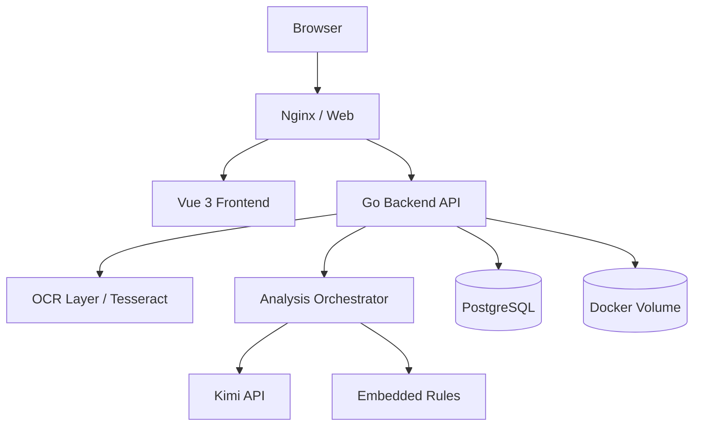
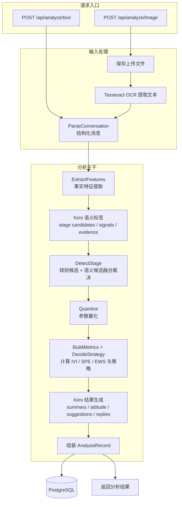

# Senti

Senti 是一个网页端聊天分析 MVP，支持上传聊天长截图或粘贴聊天文本，结合内置分析规则、后端 OCR 能力和 `Kimi API` 生成互动阶段、态度倾向、聊天建议与回复参考。

## 许可证与使用限制

本仓库根目录采用自定义限制性许可证，默认 `All Rights Reserved`。

- 允许：个人学习、内部评估、非公开测试。
- 禁止：商业使用、二次分发、对外部署、SaaS 化、付费交付、以及对产品功能/界面/流程的商业化克隆或变体复刻。
- 如需商用或授权合作，请先获得仓库权利人的书面许可。

详情见根目录的 [LICENSE](LICENSE)。

## 技术栈

- Frontend: `Vue 3` + `Vite`
- Backend: `Go`
- Database: `PostgreSQL`
- AI: `Kimi API`
- OCR: 后端 `Tesseract OCR`
- Deployment: `Docker Compose`
- Persistent Storage: `Docker Volume`

## 技术架构




### 1. 系统模块

#### 1.1 Frontend

- 提供输入页面
- 提供结果展示页面
- 提供历史记录页面
- 通过 HTTP/JSON 调用后端 API

#### 1.2 Backend API

- 接收图片上传和文本输入
- 调用后端内部 OCR 能力
- 调用分析编排层
- 读写 PostgreSQL
- 管理上传文件

#### 1.3 OCR 能力层

- 仅存在于后端内部
- 负责对聊天截图进行识别
- 输出结构化消息数据
- 不允许前端直接调用 OCR 服务

#### 1.4 分析编排层

- 负责把 `chat-skills` 规则转成程序化执行步骤
- 负责拼装发给 `Kimi API` 的提示词
- 负责约束模型输出为稳定的结构化结果
- 负责分析流程编排：
  - 图片输入时：`图片 -> 预处理 -> OCR -> 结构化 -> 分析`
  - 文本输入时：`文本 -> 清洗 -> 结构化 -> 分析`

#### 1.5 Analysis Engine

- 基于 `chat-skills` 规则做阶段识别
- 做参数量化
- 计算 `IVI`、`SPE`、`EWS`
- 生成策略结论
- 将规则计算结果与 `Kimi API` 生成结果合并为最终报告

#### 1.6 Data Storage

- `PostgreSQL` 保存分析记录、结构化消息、结果摘要、时间戳
- `Docker Volume` 持久化上传图片和中间文件

### 2. 请求处理链路

#### 2.1 图片分析链路

1. 前端上传长聊天截图到后端
2. 后端执行图片预处理
3. 后端 OCR 能力层提取聊天内容
4. 后端将 OCR 结果转成结构化消息
5. 分析编排层加载 `chat-skills` 规则
6. 分析引擎完成阶段识别、参数量化、指标计算
7. 编排层组装 Prompt 并调用 `Kimi API`
8. 后端校验并存储结果
9. 前端展示分析报告

#### 2.2 文本分析链路

1. 前端提交聊天文本到后端
2. 后端执行文本清洗和结构化
3. 分析编排层加载 `chat-skills` 规则
4. 分析引擎完成阶段识别、参数量化、指标计算
5. 编排层组装 Prompt 并调用 `Kimi API`
6. 后端校验并存储结果
7. 前端展示分析报告

### 3. 容器部署模型

- `nginx` 容器：负责 HTTPS、静态资源分发、反向代理
- `frontend` 构建产物：由 `nginx` 提供访问
- `backend` 容器：运行 Go API、OCR 调度、分析编排逻辑
- `postgres` 容器：保存业务数据
- `docker volume`：保存上传图片和中间文件

## 后端功能逻辑




补充说明：分析规则已内置在后端代码中，随后被量化逻辑和两次 Kimi 调用共同复用，因此不再单独画成多条交叉箭头。

## 本地运行

1. 复制环境变量：

```bash
cp .env.example .env
```

1. 按需填写 `.env` 中的 `KIMI_API_KEY`
2. 启动服务：

```bash
docker compose up --build
```

1. 完整重启但保留数据库和上传文件：

```bash
docker compose down
docker compose up --build -d
```

1. 打开：

- Web: `http://localhost`
- Health: `http://localhost/health`
- Prometheus: `http://localhost:9090`（仅绑定本机）
- Grafana: `http://localhost:3000`（仅绑定本机）

Grafana 默认从 `.env` 读取 `GRAFANA_ADMIN_USER` / `GRAFANA_ADMIN_PASSWORD`。生产或内测服务器上请使用 SSH 隧道访问 Grafana，不要把 3000/9090 暴露到公网。

## API

- `POST /api/auth/register`
- `POST /api/auth/login`
- `GET /api/auth/me`
- `POST /api/analyze/text`
- `POST /api/analyze/image`
- `POST /api/analyses/save`
- `GET /api/history`
- `GET /api/history/:id`
- `DELETE /api/history/:id`
- `GET /metrics`

## 监控

- 后端 `/metrics` 输出 Prometheus 文本指标，覆盖请求量、接口耗时、错误数、分析次数、Kimi 调用、OCR 调用、限流、保存/删除和数据库可用性。
- Prometheus 配置在 `deploy/prometheus/prometheus.yml`，会采集后端和 cAdvisor。
- Grafana 会自动加载 `deploy/grafana/dashboards/senti-overview.json` 大盘。
- 指标和日志只记录必要技术字段，不记录聊天原文、OCR 全文、密钥、Authorization 头或完整环境变量。

## 说明

- `KIMI_API_KEY` 为必填项，未配置时后端会直接报错。
- `INVITE_CODE` 用于限制内测注册，`AUTH_TOKEN_SECRET` 应在部署时设置为长随机值。
- Kimi 请求仅使用 `https://api.moonshot.cn/v1`。
- OCR 由后端统一调用，不直接暴露给前端。
- 分析完成后默认不保存；用户主动点击保存后，记录与图片才进入持久化存储。

