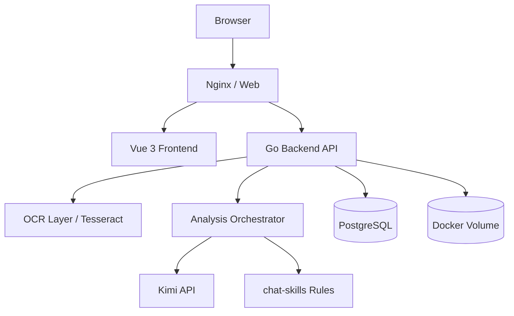
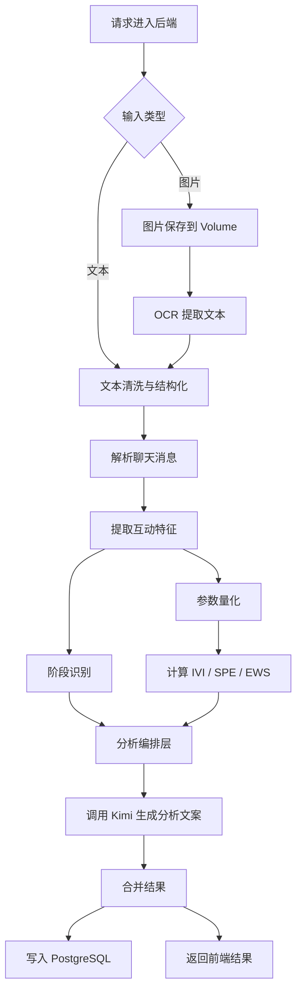

# Senti

Senti 是一个网页端聊天分析 MVP，支持上传聊天长截图或粘贴聊天文本，结合 `chat-skills` 规则、后端 OCR 能力和 `Kimi API` 生成互动阶段、态度倾向、聊天建议与回复参考。

## 技术栈

- Frontend: `Vue 3` + `Vite`
- Backend: `Go`
- Database: `PostgreSQL`
- AI: `Kimi API`
- OCR: 后端 `Tesseract OCR`
- Deployment: `Docker Compose`

## 技术架构



## 后端功能逻辑



## 本地运行

1. 复制环境变量：

```bash
cp .env.example .env
```

2. 按需填写 `.env` 中的 `KIMI_API_KEY`

3. 启动服务：

```bash
docker compose up --build
```

4. 打开：

- Web: `http://localhost`
- Health: `http://localhost/health`

## API

- `POST /api/analyze/text`
- `POST /api/analyze/image`
- `GET /api/history`
- `GET /api/history/:id`

## 说明

- `KIMI_API_KEY` 为必填项，未配置时后端会直接报错。
- OCR 由后端统一调用，不直接暴露给前端。
- 上传图片存储在 Docker Volume 中，避免容器重启后丢失。
