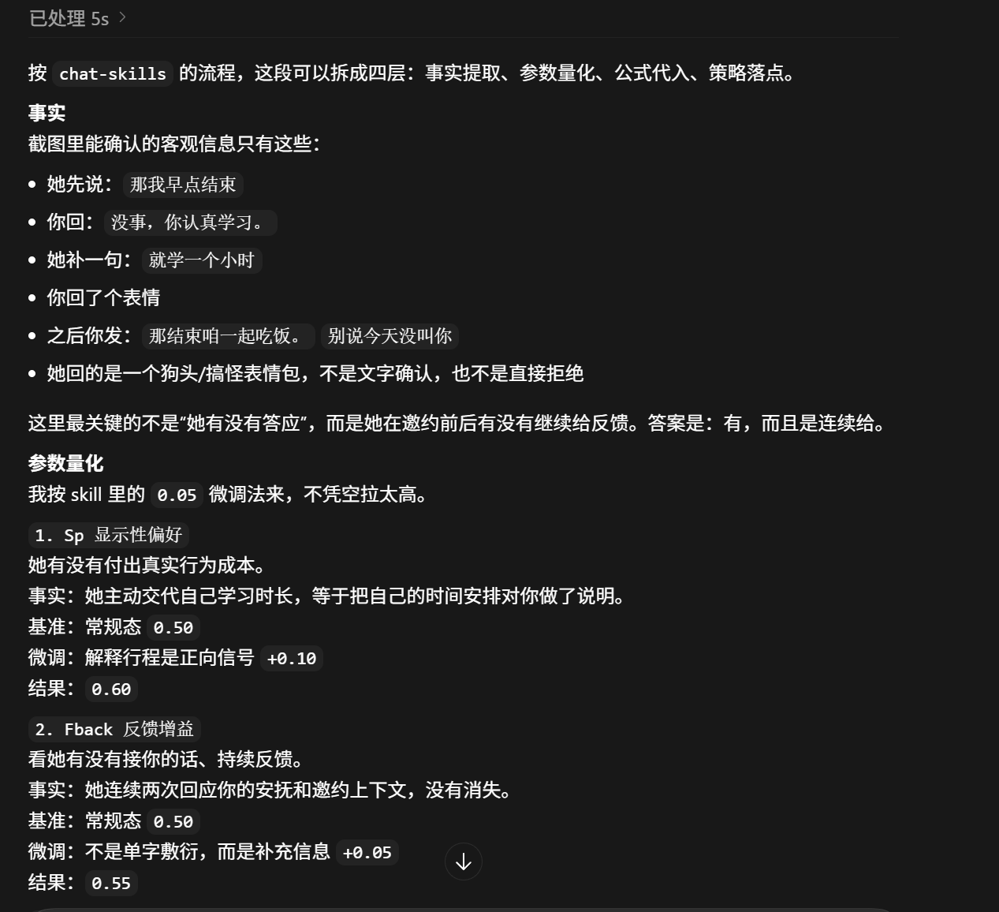
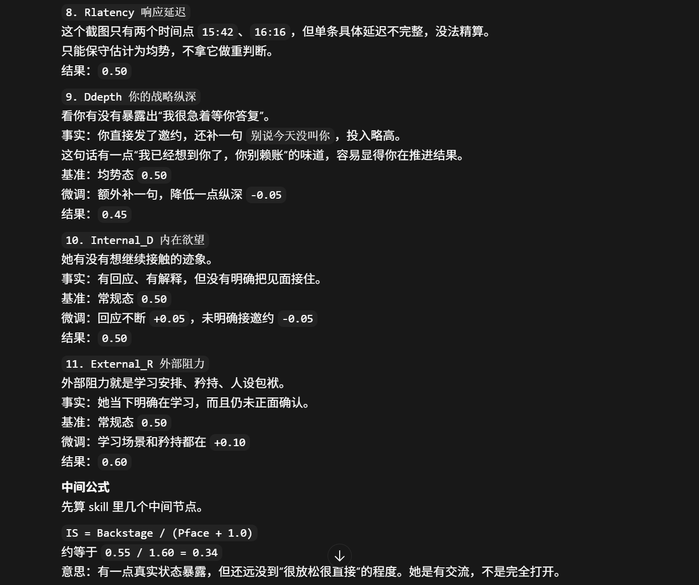

<div align="center">

# 💕Chat.skill

「市面上的情感 Skill 都在教你怎么聊，而我们教你怎么算」

[](https://opensource.org/licenses/MIT)


经验匮乏从不是软肋，用毫无逻辑的套路应对感性，才是傲慢 <br>
人的情绪完全能被抽象为参数网络。既然每份感觉都是精准加权的结果，何必要猜？<br>
拒绝话术，信仰算法。去解析她/他的底层代码<br>
接入聊天记录，全流程动态演算即刻开启!

[核心特色](#10-维跨学科引擎) · [独家算法](#独家算法将人心转化为代码) · [工作原理](#工作原理005-阶梯思维链) · [目录结构](#目录结构)

</div>

---

猜不透的局，就交回给算力去解。用穷举加权的底层模型，替你补足匮乏的实战经验；用严密的交叉运算，剥离对方所有的小心思
欢迎接入 Chat.skill 社交决策引擎，将感性的迷雾化为清晰的路径，让她的每一步都在你的计算之中

---

## 10 维跨学科引擎

系统的底层算力由数 10 个顶尖学术理论交叉融合而成，涵盖 21 个参数

| 引擎维度 | 核心逻辑与评估职责 | 参考泰斗/代表理论 |
| :--- | :--- | :--- |
| **进化心理学** | 剥离现代社交伪装，评估对方在互动中看重的是“生存资源(稳定性)”还是“繁衍价值(情绪刺激)”。 | 戴维·巴斯《进化心理学》 |
| **微观社会学** | 透视“拟剧论”。判断对方的言行是在维持“前台面子(Pface)”，还是向你开放了“后台暴露(脆弱/私密)”。 | 欧文·戈夫曼《日常生活的自我呈现》 |
| **认知心理学** | 通过制造“预期违背”与“情绪落差(Gap Effect)”，利用认知失调原理反向制造吸引力。 | 莱昂·费斯廷格《认知失调理论》 |
| **行为经济学** | 计算社交账本。衡量双方付出的绝对代价，利用损失厌恶评估对方离场时的“沉没成本(SCL)”。 | 理查德·塞勒《前景理论》 |
| **精神分析学** | 看透亲密关系中的防御机制。识别依恋类型，拆解“越喜欢越冷漠”背后的深层不安全感。 | 约翰·鲍尔比《依恋理论》 |
| **说服与影响力** | 规划“服从阶梯(Cp)”。利用承诺与一致性偏误，通过微小请求顺水推舟地完成线下邀约。 | 罗伯特·西奥迪尼《影响力》 |
| **控制论与系统论** | 充当谎言过滤器。无视对方嘴上的敷衍(噪音)，只抓取其真实付出的行为动作和时间反馈(高信噪比)。 | 诺伯特·维纳《控制论》 |
| **唯物辩证法** | 洞察事物发展的根本动力。定位“内在欲望”与“外部阻力”的主要矛盾，把握量变到质变的时机。 | 毛泽东《矛盾论》 |
| **博弈论** | 掌控社交权力动态。通过响应延迟保持战略纵深，死守纳什均衡，把控“社交势能(SPE)”。 | 约翰·纳什《纳什均衡》 |
| **概率与风险学** | 充当风控大脑。在每次建议升级前评估期望收益与下行风险，严防关系瞬间崩盘的黑天鹅事件。 | 纳西姆·塔勒布《黑天鹅》 |

---

## [独家算法](references/algorithm-weight.md)：将人心转化为代码


Chat.skill 拒绝玄学，我们内置了 12 个复杂的算法加权公式。以下是系统的 2 个杀器：

### 杀器 1：意图真实度判定 (IVI - Intent Veracity Index)
> **专治口嫌体正直与假性矜持**
> `IVI = [Sp * log(Fback + 1)] / [User_Investment * Pface]`
>
> 无论对方嘴上怎么拒绝，只要她的行为投入(Sp)够大、反馈频率(Fback)够高，系统就会判定 IVI > 1.0。会直接忽略她的表面的口是心非，坚持做该做的事

### 杀器 2：升温窗口战机锁定 (EWS - Escalation Window Score)
> **拒绝盲目冲锋，精准狙击绝杀时机**
> `EWS = (Gap_Effect * Cp_Index) + EEV`
>
> 聊得好不代表能约出来。系统结合情绪落差(Gap)与服从阶梯(Cp)，动态计算升温期望值。当 EWS 突破高位阈值时，系统自然执行下一阶段任务，一切水到渠成！

---

## 工作原理：0.05 阶梯思维链

为什么 Chat.skill 的回复极度自然、毫无“AI 翻译腔”？
因为设立了**三步漏斗量化协议 (Rule-based CoT)**。AI 在给出最终回复前，必须在后台执行严密的逻辑推演：

1. **区间锚定：** 将局势划分为 冰封/常态/沸腾 三大区间。
2. **微调捕获：** 捕捉聊天截图中的微弱信号（如一个波浪号、延迟的 10 分钟），严格以 `±0.05` 为最小单位进行算力微调。
3. **祖师爷复盘：** 算出精准数值后，AI 化身“祖师爷”人格，用损友、通透的口吻为你拆解这波操作背后的博弈逻辑各类参数，教你真正拿捏人心。

---

## 目录结构

```text
.
├── SKILL.md                 # 核心大脑：主控路由与执行管线
├── agents/
│   └── openai.yaml          # Agent 代理配置文件
└── references/
    ├── input-rules.md           # 输入规则/拆解
    ├── data-quantization-sop.md # 参数数据量化协议 (三大原型与思维链)
    ├── algorithm-weight.md      # 核心算法与参数
    └── output-rules.md          # 输出管控/规则
```

## 安装教程

### 1. 克隆仓库

```bash
git clone https://github.com/Pronting/chat-skills.git
cd chat-skills
```


### 2. 加载这个 Skill 的提示词

如果您希望 AI 帮你安装并按规范加载这个 skill，可以直接把下面这段提示词发给它：

```text
这是一个 skill 仓库，请帮我安装并按 skill 规则加载它。

请按下面顺序执行：
1. 读取根目录下的 SKILL.md，确认 skill 的名称、描述、执行流程和依赖路由。
2. 读取 agents/ 目录，确认代理配置文件（尤其是 openai.yaml）。
3. 读取 references/ 目录下的以下文件
4. 将整个 skill 安装到 Codex/claudecode/xxx claw 的 skills 目录：
5. 安装完成后，明确告诉我哪些文件已加载、skill 是否安装成功，以及是否需要重启引用。

如果当前会话不能把它正式加入可用 skill 列表，也请先直接读取上述文件内容，并按照这个 skill 的规则处理我的请求。
```

### 4. 最小加载范围

如果你不想让 AI 扫描整个目录，最少只需要让它加载这些内容：

```text
SKILL.md
agents/openai.yaml
references/input-rules.md
references/data-quantization-sop.md
references/algorithm-weight.md
references/output-rules.md
```


## 效果演示
<p align="center">
  
  
</p>


## Star History

<div align="center">
  <a href="https://star-history.com/#Pronting/chat-skills&Date">
    
  </a>
</div>


## 致谢
排名部分先后
[simp-skill](https://github.com/BeamusWayne/simp-skill)  [同事skill](https://github.com/titanwings/colleague-skill)
